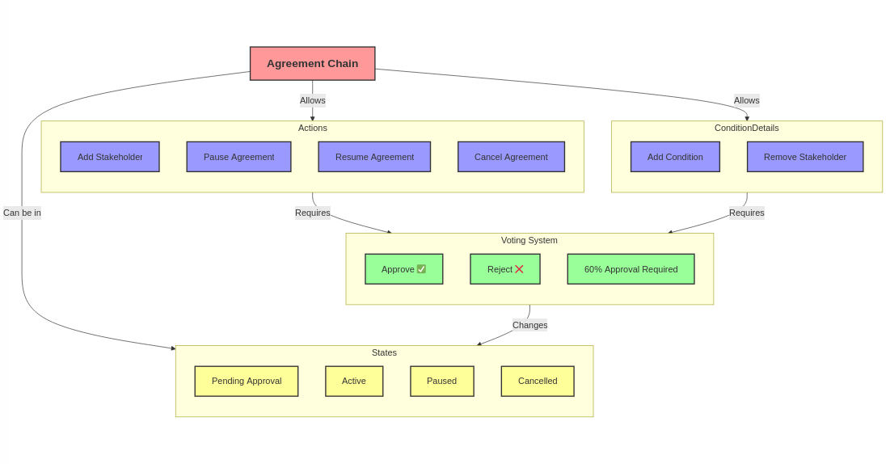

# chain_contracts

The `chain_contracts` project contains all Solidity smart contracts and related configurations for deploying and managing the DAO's blockchain infrastructure. It includes contracts for agreement creation, stakeholder management, and condition handling, ensuring a secure and decentralized agreement lifecycle.




## Table of Contents

- [Getting Started](#getting-started)
  - [Prerequisites](#prerequisites)
  - [Installation](#installation)
  - [Configuration](#configuration)
- [Features](#features)
- [Project Structure](#project-structure)

- [Deployment](#deployment)

- [Contributing](#contributing)
- [License](#license)

## Getting Started

### Prerequisites

Before you begin, ensure you have the following installed:

- **Node.js** (version 14.x or higher)
  - Recommended: Use [nvm (Node Version Manager)](https://github.com/nvm-sh/nvm) to manage Node.js versions
- **npm** or **Yarn**
  - npm (comes with Node.js)
  - or Yarn: `npm install -g yarn`
- **Hardhat**
  - Install globally: `npm install -g hardhat`
- **Ethereum Wallet**
  - MetaMask or similar Ethereum wallet for contract interactions

### Installation

1. **Clone the Repository**

   ```bash
   git clone https://github.com/srikanth-programmer/chain_contracts.git
   cd chain_contracts
   ```

2. **Install Dependencies**

   ```bash
   # Using npm
   npm install

   # Or using Yarn
   yarn install
   ```

### Configuration

1. **Hardhat Configuration**
   Modify `hardhat.config.js` to match your network configurations:

   ```javascript
   require("@nomiclabs/hardhat-waffle");

   module.exports = {
     solidity: "0.8.20",
     networks: {
       sepolia: {
         url: process.env.SEPOLIA_RPC_URL,
         accounts: [process.env.PRIVATE_KEY],
       },
     },
   };
   ```

## Features

- **Agreement Creation:** Allows creation of agreements with titles, descriptions, and conditions.
- **Stakeholder Management:** Add or remove stakeholders associated with each agreement.
- **Condition Handling:** Define and monitor conditions tied to agreements.
- **Proxy Cloning:** Utilizes OpenZeppelin's Clones for efficient contract deployment.
- **Access Control:** Ensures only authorized entities can perform sensitive actions.
- **Event Emission:** Emits events for all significant actions for easy tracking and integration.

## Project Structure

```
chain_contracts/
├── contracts/
│   ├── AgreementFactory.sol
│   ├── IAgreementFactory.sol
│   └── Agreement.sol
├── scripts/
│   ├── deploy.js
│   └── upgrade.js
├── test/
│   ├── AgreementFactory.test.js
│   └── Agreement.test.js
├── hardhat.config.js
├── package.json
└── README.md
```

### Thirdweb Deployment

```bash
# Publish contract
npx thirdweb deploy -k 'your_secret_key'

# Publish to thirdweb registry
npx thirdweb publish -k 'your_secret_key'
```

## Contributing

1. Fork the repository
2. Create your feature branch (`git checkout -b feature/AmazingFeature`)
3. Commit your changes (`git commit -m 'Add some AmazingFeature'`)
4. Push to the branch (`git push origin feature/AmazingFeature`)
5. Open a Pull Request

## License

This project is licensed under the MIT License. See the LICENSE file for details.
